# Job Board
A simple Job Listing Platform

## Dependencies
- PostgreSQL : As data storage
- Docker : To build and run the deployment images
- FE : Next.js, Ant Design

FE Repo URL: https://github.com/toufiq-austcse/job-board-fe

## Explore Rest APIs
 
 Swagger 

    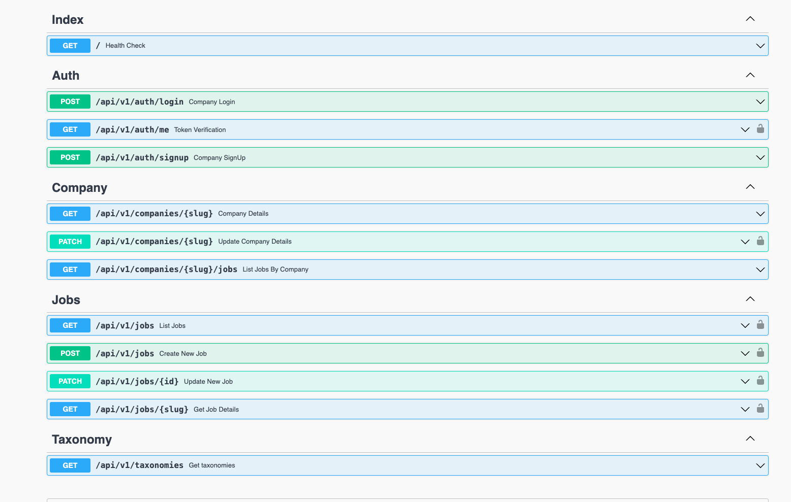

## Frontend

Click here to show the screenshots of project

    
 Home Page 

    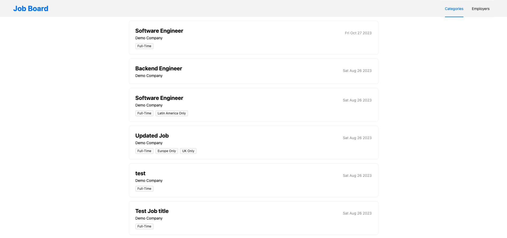
   
 Job Details 

    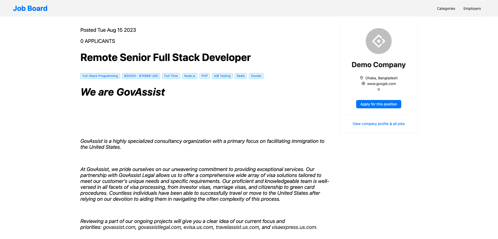
   
 Company wise job list 

    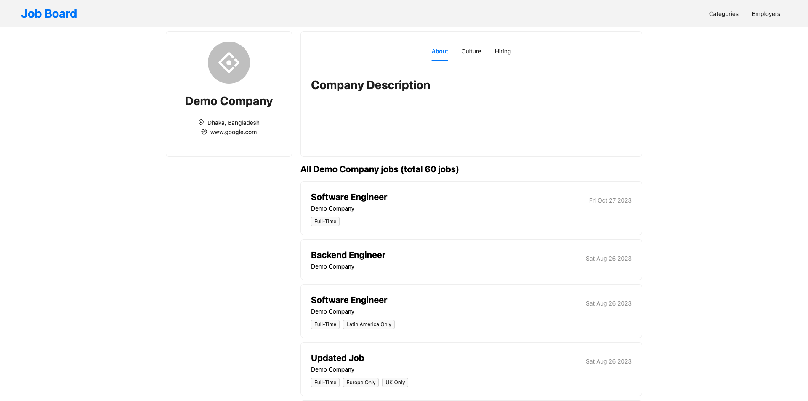
    
 Category List 

    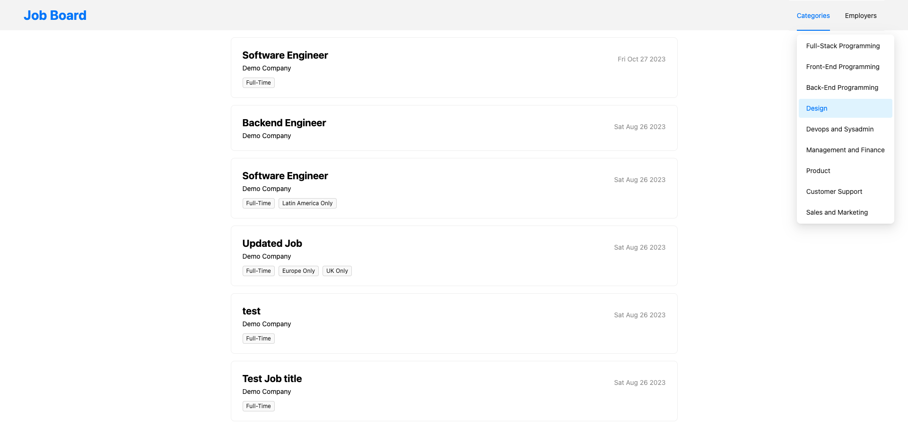
    
 Employers 

    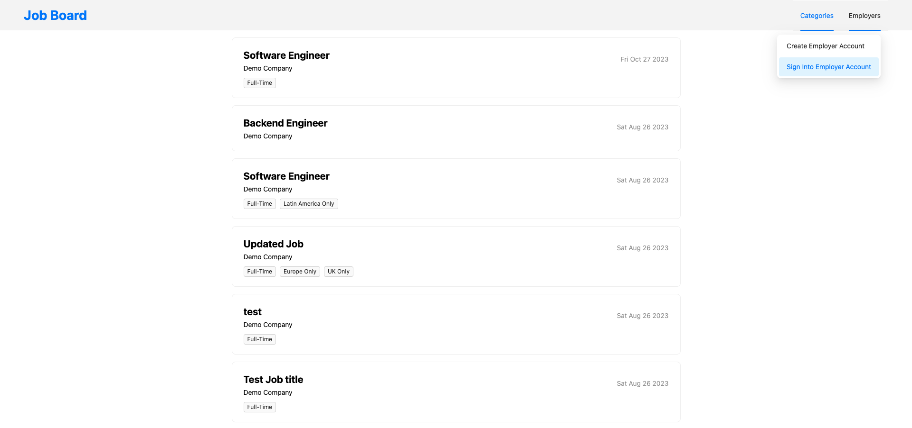
    
 Login

    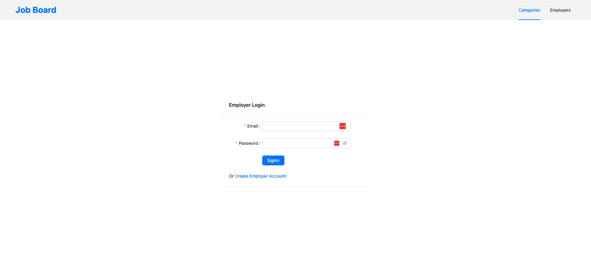
    
 Register

    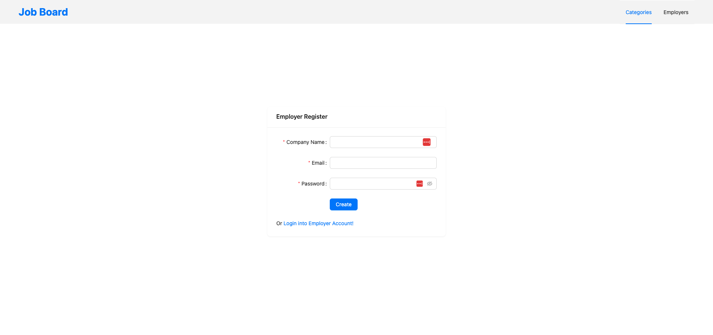
    
 Employer Account 

    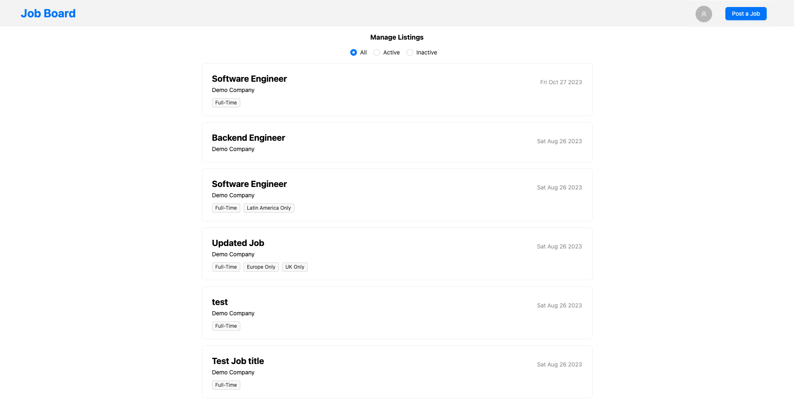
    
 Edit Company 

    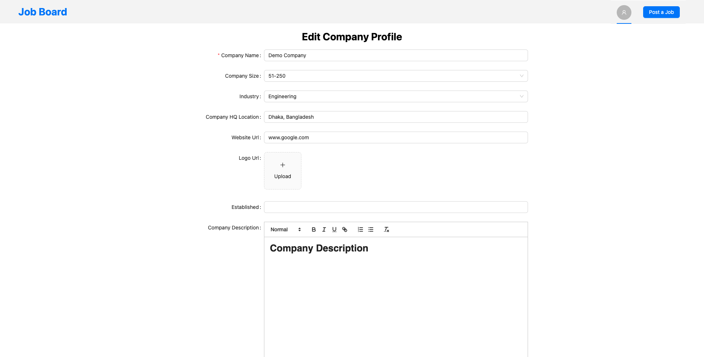
    
 Create New Job 

    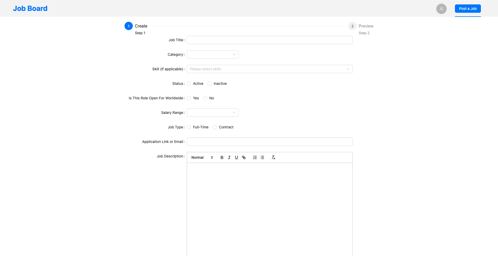

